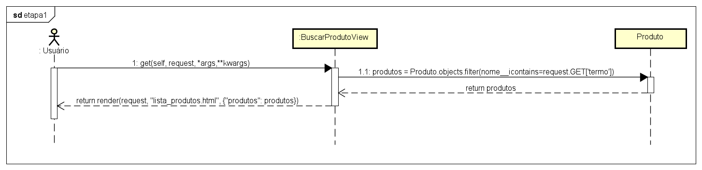

# CDU002. Buscar Produto

- **Ator principal:** Visitante, Comprador, Administrador e Gerente  
- **Atores secundários:** Não possui
- **Resumo:** O usuário deseja localizar um produto específico digitando seu nome (ou parte dele) na barra de busca. O sistema retorna os produtos que contêm o termo informado.  
- **Pré-condição:** O produto existir no catálogo  
- **Pós-condição:** Exibir a lista de produtos que correspondem ao termo pesquisado pelo usuário  

---

## Fluxo Principal

| Ações do ator | Ações do sistema |
| :------------- | :---------------- |
| 1 - O usuário acessa a página inicial ou a seção de produtos. | |
| 2 - O usuário insere o nome (ou parte dele) do produto no campo de busca e confirma a pesquisa. | |
| | 3 - O sistema realiza a consulta no banco de dados utilizando o termo informado. |
| | 4 - O sistema exibe a lista de produtos cujo nome contém o termo pesquisado. |

---

## Fluxo Alternativo I - Produto não existente

| Ações do ator | Ações do sistema |
| :------------- | :---------------- |
| 1.1 - O usuário realiza a busca com um termo que não corresponde a nenhum produto cadastrado. | |
| | 1.2 - O sistema informa que “nenhum produto foi encontrado”. |
| (fluxo finalizado) | |

---

> Obs. as seções a seguir apenas serão utilizadas na segunda unidade do PDSWeb (segundo orientações do gerente do projeto).

## Diagrama de Interação (Sequência ou Comunicação)

## Diagrama de Classes de Projeto

> Substituir pela imagem contendo as classes (modelo, visão e templates) que implementam o respectivo CDU...
